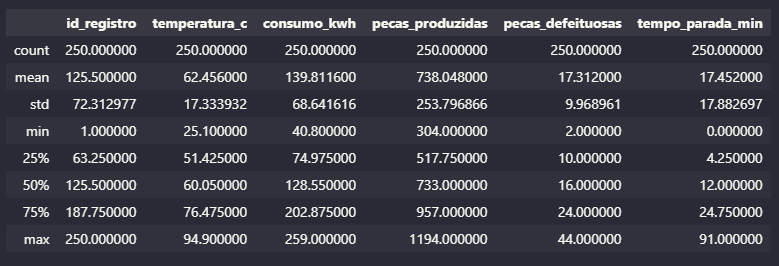
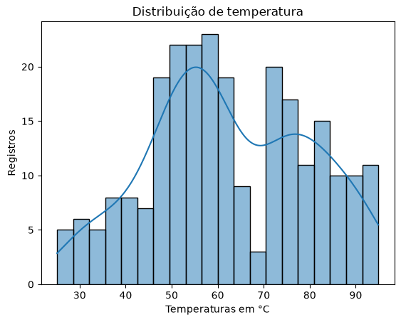
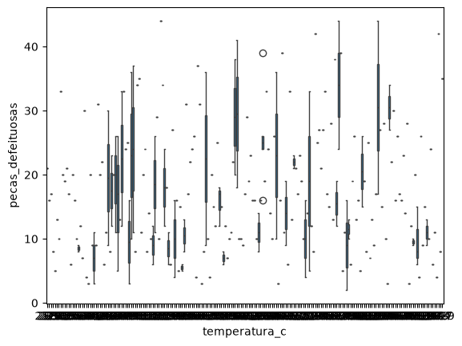

# Iadados


## Pandas
Pra isso precisa do arquivo .csv, no caso a tabela do exel.
Tendo a tabela, importa o pandas e nome como pd
```py
import pandas as pd
```

Apos ter importado o pandas, temos que ler a base de dados:
```py
df = pd.read_csv("monitoramento_maquinas.csv")
```

Apos lermos a tabela, para mostrar apenas 5 valores da tabela:
```py
df.head()
```

E para mostrar os 5 ultimos:
```py
df.tail()
```

Quando queremos contar quantos valores temos na tabela:
```py
df.shape()
```

Quando queremos ver informações gerais da base de dados:
```py
df.info()
```

Quando queremos descrobrir mto mais informações, tipo, a media e entre outras
```py
df.describe()
```



- **Mean:** é a média
- **Std:** o desvio padrão
- **Min:** o menor valor
- **25%:** 25% dos valores estão até esse ponto
- **50%:** é a mediana
- **75%:** 75% dos valores estão até esse ponto
- **Max:** maior valor


# seaborn
O seaborn usa pra se criar graficos, na pratica, um grafico de colunas fica:
```py
grafico = sns.histplot(data=df, x="temperatura_c", kde=True,bins=20)
```




- **sns.histplot()** **(histograma)**:  Faz com que cria um grafico de colunas sobre a base de dados

- **data=df:** define o DataFrame que contém os dados.
- **x="temperatura_c":** Fala sobre oque sera a coluna da tabela sera o graficio
- **kde=True:** adiciona uma linha pro grafico
- **bins=20:** quantidade de quadrados, quanto maior o bins, mais detalhado sera o grafico
- **set_title():** define o nome do gráfico
- **set_xlabel():** define o nome do eixo X
- **set_ylabel():** define o nome do eixo Y

Histograma permite observar como os registros de temperatura estão distribuídos, identificando as faixas de temperatura com maior ou menor frequência.

### Boxplot
Serve pra relacionar uma parte da tabela com outra
```py
grafico = sns.boxplot(data=df, x="temperatura_c",y="pecas_defeituosas")
```




