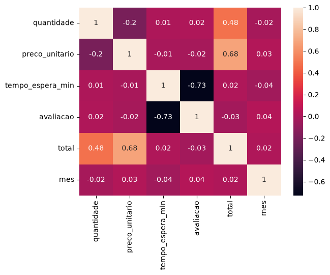

# Iadados


## Pandas
Pra isso precisa do arquivo .csv, no caso a tabela do exel.
Tendo a tabela, importa o pandas e nome como pd
```py
import pandas as pd
```

Apos ter importado o pandas, temos que ler a base de dados:
```py
df = pd.read_csv("monitoramento_maquinas.csv")
```

Apos lermos a tabela, para mostrar apenas 5 valores da tabela:
```py
df.head()
```

E para mostrar os 5 ultimos:
```py
df.tail()
```

Quando queremos contar quantos valores temos na tabela:
```py
df.shape()
```

Quando queremos ver informações gerais da base de dados:
```py
df.info()
```

Quando queremos descrobrir mto mais informações, tipo, a media e entre outras
```py
df.describe()
```


- **Mean:** é a média
- **Std:** o desvio padrão
- **Min:** o menor valor
- **25%:** 25% dos valores estão até esse ponto
- **50%:** é a mediana
- **75%:** 75% dos valores estão até esse ponto
- **Max:** maior valor


Quando quero exibir apenas uma unica coluna
```py
df["produto"]
```


Quando quero filtrar por mais de uma coluna, usa 2 colchetes `[]`
```py
df[["produto","preco_unitario"]]
```

Quando quero contar quantos produtos tem na tabela, sendo assim contando todos os produtos da coluna
```py
df["produto"].value_counts()
```
Quando querofazer o total dos produtos
```py
df["total"] = df["quantidade"] * df["preco_unitario"]
df.head()
```
sendo assim eu crio uma nova coluna chamada total, ela é igual a quantidade * o preco_unitario

---

Mostrar o fatoramento total
```py
print("Fatoramento total: ", df["total"].sum())
```

Mostrar o valor medio por venda
```py
print(f"Valor medio por venda: {df["total"].mean():.2f}")
```

Quando eu quero filtrar os dados nulos
```py
df.isna().sum()
```

Quando eu quero eliminar os dados nulos:
```py
df.dropna().shape
```


---

# seaborn
O seaborn usa pra se criar graficos, na pratica, um grafico de colunas fica:
```py
grafico = sns.histplot(data=df, x="temperatura_c", kde=True,bins=20)
```


- **sns.histplot()** **(histograma)**:  Faz com que cria um grafico de colunas sobre a base de dados

- **data=df:** define o DataFrame que contém os dados.
- **x="temperatura_c":** Fala sobre oque sera a coluna da tabela sera o graficio
- **kde=True:** adiciona uma linha pro grafico
- **bins=20:** quantidade de quadrados, quanto maior o bins, mais detalhado sera o grafico
- **set_title():** define o nome do gráfico
- **set_xlabel():** define o nome do eixo X
- **set_ylabel():** define o nome do eixo Y

Histograma permite observar como os registros de temperatura estão distribuídos, identificando as faixas de temperatura com maior ou menor frequência.

### Boxplot
Serve pra relacionar uma parte da tabela com outra
```py
grafico = sns.boxplot(data=df, x="temperatura_c",y="pecas_defeituosas")
```


### to_datetime

Transforma os dados de uma coluna em formato de data, permitindo que o Pandas reconheça e trabalhe com datas.

ex:
```py
#transformou a coluna data em formato de data
df["data"] = pd.to_datetime(df["data"])

#pegou o mes da data e criou uma nova coluna chamada mes
df["mes"] = df["data"].dt.month

#agrupou os dados pelo mes, pegou o total e somou
df.groupby("mes")["total"].sum()
```
Ou seja:

- pd.to_datetime(): transforma os valores em formato de data.

- .dt.month: pega o numero do mes da data.

- groupby("mes"): agrupa os dados de acordo com o mes.

- ["total"]: pega a coluna total.

- sum(): soma os valores de cada mes.

Sendo assim, o código transforma a coluna data, cria uma nova coluna chamada mes e agrupa os dados de cada mes, somando o total de cada um.

### groupby() e mean()

Quando quero saber a média das avaliações de cada canal:

```py
#agrupou os dados por canal e calculou a media das avaliacoes de cada um
df.groupby("canal")["avaliacao"].mean()
```

Ele separa as avaliações por canal e calcula a média de cada um.

## Faturamento por produto

```py
# Agrupe os produtos e some o faturamento de cada um
faturamento_pro_produto = df.groupby("produto")["total"].sum().reset_index()

# Crie um gráfico de barras
sns.barplot(data=faturamento_pro_produto, x="total", y="produto")

# Mostre o gráfico
plt.show()
```

**Porque usar o `.reset_index()`**
O `.reset_index()` transforma o índice em uma coluna normal do DataFrame.

```python
faturamento_pro_produto = df.groupby("produto")["total"].sum().reset_index()
```

### Mapa de calor da correlação (heatmap)

Serve pra ver de forma rápida, quais colunas da tabela têm relação entre si.

ex:
```py
numeros = df[["quantidade", "preco_unitario", "tempo_espera_min", "avaliacao", "total", "mes"]]
sns.heatmap(data=numeros.corr().round(2), annot=True)
```

- **numeros = df[[...]]:** cria uma nova tabela só com as colunas que são números. Usa 2 colchetes `[[]]` porque estou filtrando mais de uma coluna.

- **.corr():** calcula a correlação entre cada par de colunas.

- **.round(2):** arredonda os valores para 2 casas decimais, pra ficar mais fácil de ler.

- **sns.heatmap():** desenha a tabela de correlação como um mapa de cores.

- **data=:** define qual tabela vai virar o gráfico.

- **annot=True:** escreve o número dentro de cada quadradinho.

#### Como ler o resultado

A correlação vai de **-1 até 1**:

- **Perto de 1:** as duas colunas sobem juntas. Ex: quanto maior a `quantidade`, maior o `total`.
- **Perto de -1:** uma sobe e a outra desce. Ex: quanto maior o `tempo_espera_min`, menor a `avaliacao`.
- **Perto de 0:** não tem relação entre elas.

A diagonal sempre vale 1, porque cada coluna é igual a ela mesma.



